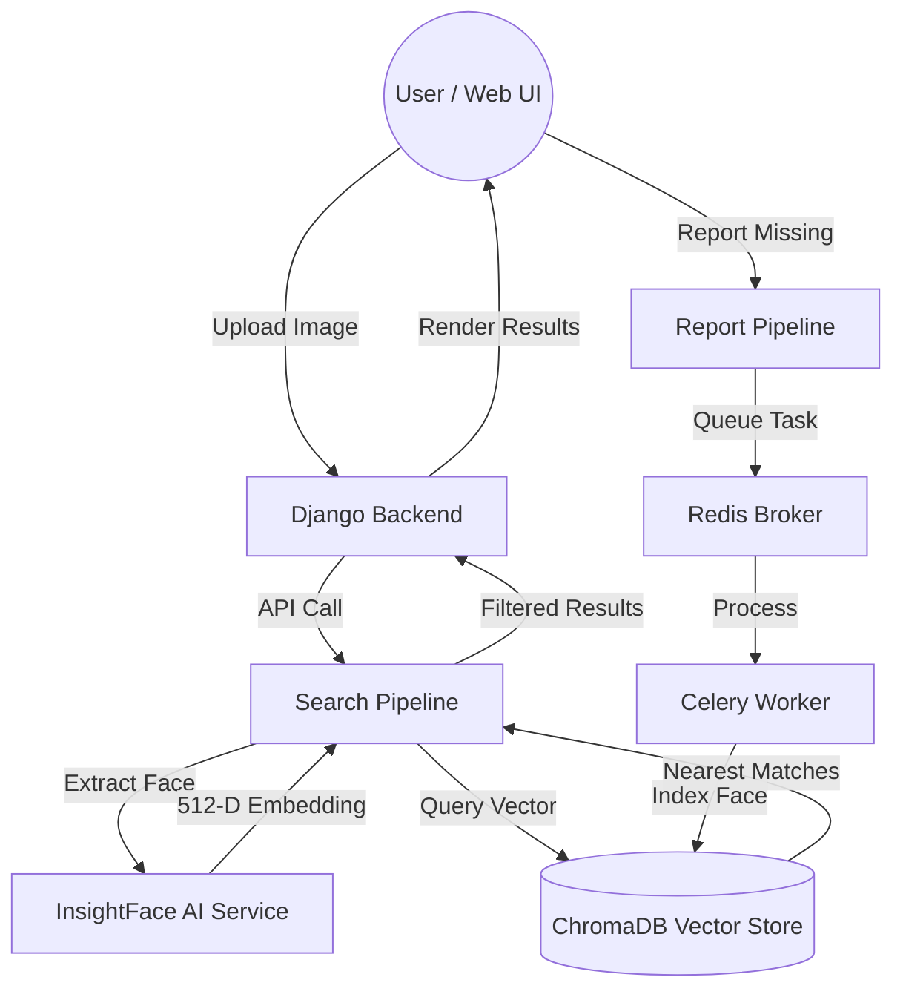

**Mafqood AI** is an advanced facial recognition and reporting system designed to help find missing persons. It uses state-of-the-art computer vision and vector search to match reported individuals against a database of known faces.

## 📊 System Architecture Flow



## 🏗️ Architecture Overview

The system is built with a modular, scalable architecture:

- **Backend**: Django (with Django REST Framework) for API and management.
- **Computer Vision**: [InsightFace](https://github.com/deepinsight/insightface) for high-accuracy face detection and 512-D embedding extraction.
- **Vector Database**: [ChromaDB](https://www.trychroma.com/) for efficient similarity search using HNSW (Cosine Space).
- **Task Queue**: [Celery & Redis](https://docs.celeryq.dev/en/stable/getting-started/introduction.html) for asynchronous processing of reports and heavy AI tasks.
- **Internal Pipelines**: Specialized domain logic for `Search` and `Report` workflows.

## 🚀 Recent Updates & Fixes

We have recently completed a series of architectural hardenings:

- **Infrastructure Integration**: Fixed persistent Celery connection issues by standardizing Django-Celery integration.
- **Module Resolution**: Resolved `ModuleNotFoundError` for the `app` package by making entry points (`manage.py`, `wsgi.py`) project-aware.
- **UI Enhancements**: 
    - Added a **Detail Modal** to show full metadata for each match.
    - Integrated **Image Serving** from `temp_uploads`.
    - Fixed template rendering errors.
- **Scoring Logic**: Implemented score clamping and filtering (only results with **> 40% match** are displayed).

## 📂 Project Structure

```text
ai_system/
├── app/                  # Main Django Application
│   ├── mafqood_project/  # Project Settings & Routing
│   ├── core_api/         # Main UI Views & Controllers
│   ├── people/           # People Management API
│   ├── search/           # Face Search API
│   └── templates/        # HTML Templates
├── services/             # Core AI Services (FaceSearchService)
├── temp_uploads/         # Uploaded images (Media Root)
└── run_dev.sh            # One-click launch script
```

## 🛠️ Getting Started

### Prerequisites
- Python 3.10+
- Redis Server (Running on `localhost:6379`)

### Installation
1. Install dependencies:
   ```bash
   pip install -r app/requirements.txt
   ```
2. Set up permissions:
   ```bash
   chmod +x run_dev.sh
   ```

### Running the Project
Simply run the development utility:
```bash
./run_dev.sh
```
The server will be available at `http://localhost:8000`.

## 📡 API Endpoints
- `POST /api/people/report/`: Submit a new missing person report.
- `POST /api/search/face/`: Search for a face by image.
- `GET /results/`: View UI results for the last search.

---

