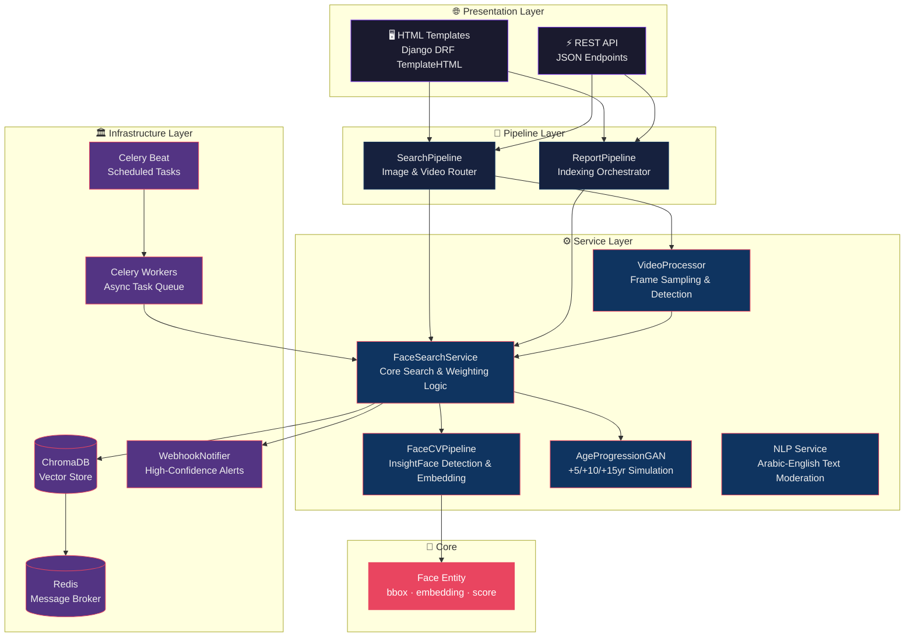
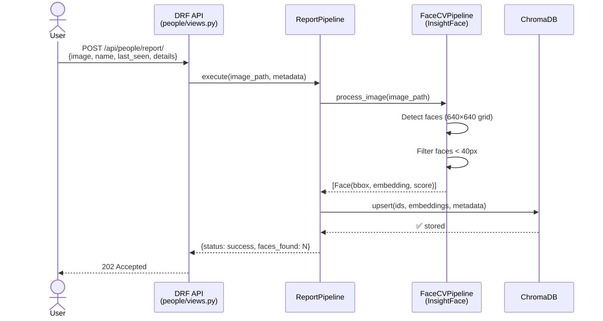
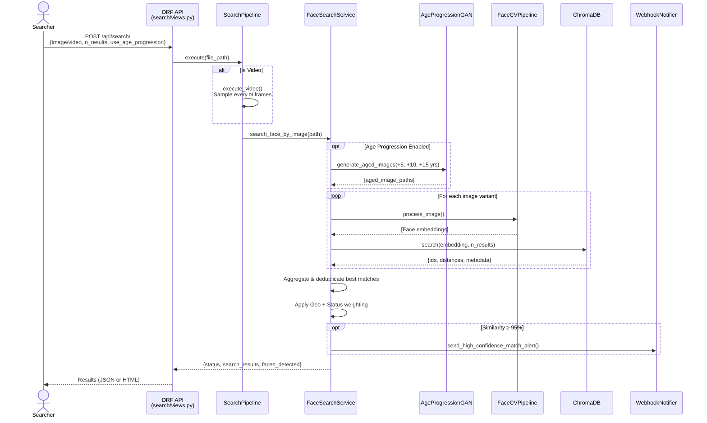
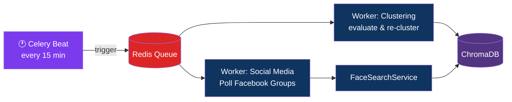

<div align="center">

# 🔍 Mafqood AI — مفقود

### *AI-Powered Missing Persons Search & Recognition Platform*

[](https://python.org)
[](https://djangoproject.com)
[](https://www.django-rest-framework.org/)
[](https://docs.celeryq.dev/)
[](https://redis.io)
[](https://trychroma.com)
[](https://docs.docker.com/compose/)
[](https://insightface.ai)

<br/>

> **Mafqood** is a production-grade AI system designed to help locate missing persons by leveraging state-of-the-art face recognition, vector similarity search, age progression simulation, and video intelligence — all exposed through a clean Django REST API.

<br/>

---
</div>

## 📖 Table of Contents

- [✨ Key Features](#-key-features)
- [🏗️ Architecture](#️-architecture)
- [🔄 System Workflow](#-system-workflow)
- [📁 Project Structure](#-project-structure)
- [🛠️ Tech Stack](#️-tech-stack)
- [⚙️ Configuration](#️-configuration)
- [🚀 How to Run](#-how-to-run)
- [📡 API Reference](#-api-reference)
- [🧪 Testing](#-testing)
- [👨‍💻 Author](#-author)

---

## ✨ Key Features

| Feature | Description |
|--------|-------------|
| 🎯 **Face Detection & Embedding** | Powered by InsightFace (`buffalo_l` model), detects and embeds faces at 512-dimensional vectors |
| 🔍 **Vector Similarity Search** | ChromaDB used as a persistent vector database for fast approximate nearest-neighbor (ANN) face lookups |
| 🎞️ **Video Intelligence** | Frame-sampled face search across uploaded video files with deduplication across frames |
| 🧬 **Age Progression** | GAN-based module generates +5/+10/+15 year facial variations to find long-missing persons |
| 📊 **Smart Weighting** | Geospatial and case-status weightings applied on top of raw similarity scores |
| 🔔 **Webhook Alerts** | Automatic high-confidence match (≥95%) webhook notifications to external systems |
| ⚙️ **Async Task Queue** | Celery + Redis for background indexing, clustering, and social media polling |
| 🌐 **Dual Renderer** | DRF views render both JSON (API) and HTML (template-based UI) from the same endpoint |
| 🧹 **NLP Moderation** | Arabic/English text cleaning and bad-words classification with LLM-powered fallback |

---

## 🏗️ Architecture

The system follows a **Domain-Driven, Layered Architecture** — cleanly separating concerns across API, Pipeline Orchestration, Services, and Infrastructure layers.



---

## 🔄 System Workflow

### 📥 Reporting a Missing Person (Indexing Flow)



### 🔎 Searching for a Person (Search Flow)



### ⏰ Background Task Workflow (Celery)



---

## 📁 Project Structure

```
ai_system/
├── 📦 app/                         # Django Application Root
│   ├── 🔧 config.py                # Centralized configuration (env-aware)
│   ├── ⚡ celery_app.py             # Celery app + Beat schedule definitions
│   ├── 🧩 pipelines/
│   │   ├── search_pipeline.py      # Orchestrates image & video search
│   │   └── report_pipeline.py      # Orchestrates missing person indexing
│   ├── 🔎 search/                  # Face Search Django App
│   │   ├── views.py                # FaceSearchView (DRF APIView)
│   │   ├── serializers.py          # Input validation
│   │   └── urls.py
│   ├── 👤 people/                  # Missing Person Reporting App
│   │   ├── views.py                # ReportMissingPersonView
│   │   ├── models.py
│   │   └── serializers.py
│   ├── 🖥️ templates/               # Jinja2/Django HTML templates
│   │   ├── results.html
│   │   ├── report.html
│   │   └── video_search.html
│   └── 🏠 mafqood_project/         # Django project settings
│       └── settings.py
│
├── ⚙️ services/                    # Domain Services (Framework-Agnostic)
│   ├── cv_service.py               # InsightFace detection + embedding (Singleton)
│   ├── face_search_service.py      # Core face search, index, delete, weighting
│   ├── age_progression_service.py  # GAN-based +5/+10/+15yr age simulation
│   ├── video_pipeline.py           # Frame sampling & face detection for videos
│   ├── nlp_service.py              # Arabic/English text cleaning & classification
│   └── clustering_service.py       # Unsupervised face clustering
│
├── 🏛️ infra/                       # Infrastructure Layer
│   ├── repositories/
│   │   └── vector_db_repo.py       # ChromaDB abstraction (VectorDB)
│   ├── external/
│   │   └── webhook_notifier.py     # High-confidence match HTTP webhooks
│   └── celery/
│       └── tasks.py                # Async Celery task definitions
│
├── 🧱 core/
│   └── entities.py                 # Core Face entity (bbox, embedding, score)
│
├── 🛠️ utils/
│   └── file_utils.py               # Temp file cleanup utilities
│
├── 🧪 tests/                       # Test Suite
├── 📜 scripts/                     # Helper scripts
├── 🐳 Dockerfile                   # Docker image definition
├── 🐳 docker-compose.yml           # Full stack orchestration
├── 📋 requirements.txt
└── 🔧 Makefile                     # Developer shortcuts
```

---

## 🛠️ Tech Stack

<table>
<thead>
<tr>
<th>Category</th>
<th>Technology</th>
<th>Purpose</th>
</tr>
</thead>
<tbody>
<tr>
<td><strong>🌐 Web Framework</strong></td>
<td>Django 6 + Django REST Framework</td>
<td>API endpoints, dual JSON/HTML rendering, serialization</td>
</tr>
<tr>
<td><strong>👁️ Face Recognition</strong></td>
<td>InsightFace (<code>buffalo_l</code>) + ONNX Runtime</td>
<td>Face detection, alignment, and 512-d embedding extraction</td>
</tr>
<tr>
<td><strong>🖼️ Computer Vision</strong></td>
<td>OpenCV 4.8</td>
<td>Image I/O, video frame sampling, and age effect simulation</td>
</tr>
<tr>
<td><strong>🗄️ Vector Database</strong></td>
<td>ChromaDB 0.4</td>
<td>Persistent face embedding storage and ANN similarity search</td>
</tr>
<tr>
<td><strong>📨 Task Queue</strong></td>
<td>Celery 5.2 + Redis 7</td>
<td>Background indexing, clustering jobs, and social media polling</td>
</tr>
<tr>
<td><strong>🤖 LLM Integration</strong></td>
<td>OpenAI API</td>
<td>Contextual text appropriateness classification</td>
</tr>
<tr>
<td><strong>🧠 ML Utilities</strong></td>
<td>scikit-learn, NumPy, Pillow</td>
<td>Clustering, numerical ops, image preprocessing</td>
</tr>
<tr>
<td><strong>🐳 Containerization</strong></td>
<td>Docker + Docker Compose</td>
<td>Full stack orchestration (API, worker, beat, flower, redis)</td>
</tr>
<tr>
<td><strong>📊 Monitoring</strong></td>
<td>Flower</td>
<td>Celery task monitoring dashboard on port 5555</td>
</tr>
<tr>
<td><strong>🧪 Testing</strong></td>
<td>pytest + pytest-asyncio + pytest-mock</td>
<td>Unit and integration testing</td>
</tr>
</tbody>
</table>

---

## ⚙️ Configuration

Copy `.env` and configure the following variables:

```bash
cp .env.example .env
```

| Variable | Default | Description |
|---|---|---|
| `REDIS_URL` | `redis://localhost:6379/0` | Redis broker connection string |
| `CHROMA_DB_PATH` | `./chroma_db` | ChromaDB persistence directory |
| `CV_CTX_ID` | `-1` | InsightFace compute device: `-1` = CPU, `0` = GPU |
| `INSIGHTFACE_OFFLINE` | *(unset)* | Set to `1` to skip model download (for CI/testing) |
| `DJANGO_SETTINGS_MODULE` | `mafqood_project.settings` | Django settings module |

---

## 🚀 How to Run

### 🐳 Option 1 — Docker Compose (Recommended)

Start the full stack with a single command:

```bash
# Clone the repo
git clone https://github.com/blackeagle686/mafqood-ai.git
cd mafqood-ai/ai_system

# Build and start all services
docker-compose up --build -d
```

Services launched:

| Service | Container | Port | Description |
|---|---|---|---|
| 🌐 Django API | `mafqood_api` | `8000` | Main web application |
| ⚡ Celery Worker | `mafqood_worker` | — | Background task processor |
| 🕐 Celery Beat | `mafqood_beat` | — | Periodic task scheduler |
| 📊 Flower | `mafqood_flower` | `5555` | Task monitoring dashboard |
| 🗄️ Redis | `mafqood_redis` | `6379` | Message broker |

```bash
# Check service health
docker-compose ps

# View API logs
docker-compose logs -f app

# Stop everything
docker-compose down
```

---

### 💻 Option 2 — Local Development

#### Prerequisites

- Python 3.10+
- Redis running locally (`redis-server`)

#### Setup

```bash
cd ai_system

# Create and activate virtual environment
python -m venv .venv
source .venv/bin/activate

# Install dependencies
pip install -r requirements.txt

# Apply database migrations
python app/manage.py migrate

# Start the Django development server
python app/manage.py runserver 0.0.0.0:8000
```

#### Start Background Workers (separate terminal)

```bash
# Celery Worker
celery -A app.celery_app worker --loglevel=info

# Celery Beat Scheduler (another terminal)
celery -A app.celery_app beat --loglevel=info
```

#### Quick Start Script

```bash
chmod +x quickstart.sh
./quickstart.sh
```

---

### ☁️ Option 3 — Google Colab

Use the Colab launcher for cloud testing:

```bash
python colab_launcher.py
```

---

## 📡 API Reference

### `POST /api/people/report/`
> Report a missing person and index their face into the vector database.

**Request** (`multipart/form-data`):
| Field | Type | Required | Description |
|---|---|---|---|
| `file` | Image | ✅ | Photo of the missing person |
| `name` | string | ✅ | Full name |
| `last_seen` | string | ✅ | Last known location |
| `details` | string | ✅ | Additional information |

**Response** `202 Accepted`:
```json
{
  "status": "success",
  "message": "Report received and is being processed."
}
```

---

### `POST /api/search/`
> Search for a person by uploading a photo or video.

**Request** (`multipart/form-data`):
| Field | Type | Default | Description |
|---|---|---|---|
| `file` | Image / Video | ✅ | Query photo or video file |
| `n_results` | integer | `5` | Max number of matches to return |
| `use_age_progression` | boolean | `false` | Enable +5/+10/+15yr face aging |
| `sampling_rate` | integer | `15` | Frame sampling rate for videos |

**Response** `200 OK`:
```json
{
  "status": "success",
  "search_results": [
    {
      "id": "photo_0",
      "distance": 0.12,
      "similarity": 88.0,
      "metadata": {
        "name": "Ahmad",
        "last_seen": "Cairo",
        "original_image": "/media/photo.jpg"
      }
    }
  ],
  "faces_detected": 1,
  "used_age_progression": false
}
```

---

## 🧪 Testing

```bash
# Run all tests
pytest tests/ -v

# Run with coverage
pytest tests/ --cov=services --cov=app --cov-report=term-missing

# Run local integration test (synchronous)
python run_local_test.py

# Docker test environment
docker-compose -f docker-compose.test.yml up --build --abort-on-container-exit
```

---

## 🔧 Makefile Shortcuts

```bash
make build       # Build Docker images
make up          # Start all services
make down        # Stop all services
make logs        # Follow application logs
make test        # Run test suite
make migrate     # Apply Django migrations
make shell       # Open Django shell
```

---

## 📊 System Monitoring

Once running, access the **Flower dashboard** for real-time Celery task monitoring:

```
http://localhost:5555
```

---

## 👨‍💻 Author

<div align="center">

<br/>

### Built with ❤️ to help reunite families

<br/>

[](https://github.com/blackeagle686)

<br/>

*"Every face has a story. Every search brings someone home."*

<br/>

---

**Mafqood AI** · مفقود · *Missing Persons Intelligence Platform*

</div>

