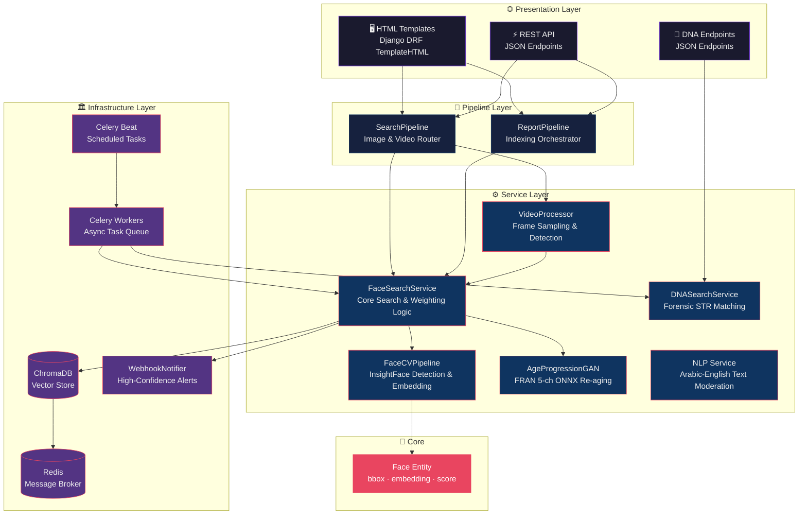
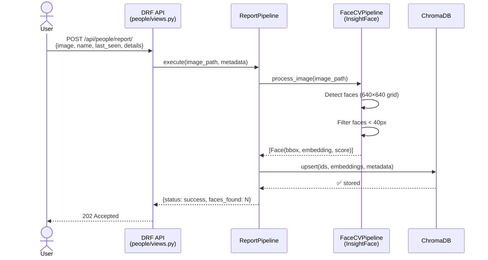
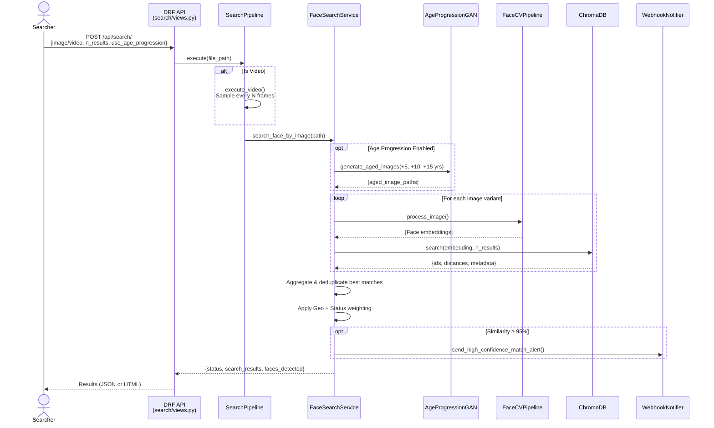
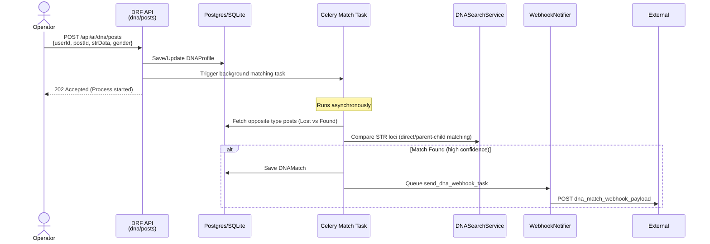

<div align="center">
 
# 🔍 Athar AI — اثر
 
### *AI-Powered Missing Persons Search & Recognition Platform*
 
[](https://python.org)
[](https://djangoproject.com)
[](https://www.django-rest-framework.org/)
[](https://docs.celeryq.dev/)
[](https://redis.io)
[](https://trychroma.com)
[](https://docs.docker.com/compose/)
[](https://insightface.ai)
 
<br/>
 
> **Athar** is a production-grade AI system designed to help locate missing persons by leveraging state-of-the-art face recognition, vector similarity search, CPU-optimized age progression simulation, forensic DNA matching, and video intelligence — all exposed through a clean Django REST API.
 
<br/>
 
---
</div>
 
## 📖 Table of Contents
 
- [✨ Key Features](#-key-features)
- [🏗️ Architecture](#️-architecture)
- [🔄 System Workflow](#-system-workflow)
- [📁 Project Structure](#-project-structure)
- [🛠️ Tech Stack](#️-tech-stack)
- [⚙️ Configuration](#️-configuration)
- [🚀 How to Run](#-how-to-run)
- [📡 API Reference](#-api-reference)
- [🧪 Testing](#-testing)
- [👨‍💻 Author](#-author)
 
---
 
## ✨ Key Features
 
| Feature | Description |
|--------|-------------|
| 🎯 **Face Detection & Embedding** | Powered by InsightFace (`buffalo_l` model), detects and embeds faces at 512-dimensional vectors |
| 🔍 **Vector Similarity Search** | ChromaDB used as a persistent vector database for fast approximate nearest-neighbor (ANN) face lookups |
| 🎞️ **Video Intelligence** | Frame-sampled face search across uploaded video files with deduplication across frames |
| 🎨 **CPU-Optimized Age Progression** | FRAN U-Net neural model compiled to ONNX, dynamically processing 5-channel residual age mappings without GPU dependencies |
| 🧬 **Forensic DNA STR Matching** | Direct, parent-child, and sibling matching using JSON STR locus profiles, operating asynchronously in Celery |
| 📊 **Smart Weighting** | Geospatial and case-status weightings applied on top of raw similarity scores |
| 🔔 **Webhook Alerts** | Automatic high-confidence match (≥95% face or DNA match) webhook notifications to external systems |
| ⚙️ **Async Task Queue** | Celery + Redis for background indexing, clustering, and social media polling |
| 🌐 **Dual Renderer** | DRF views render both JSON (API) and HTML (template-based UI) from the same endpoint |
| 🧹 **NLP Moderation** | Arabic/English text cleaning and bad-words classification with LLM-powered fallback |
 
---
 
## 🏗️ Architecture
 
The system follows a **Domain-Driven, Layered Architecture** — cleanly separating concerns across API, Pipeline Orchestration, Services, and Infrastructure layers.
 

 
---
 
## 🔄 System Workflow
 
### 📥 Reporting a Missing Person (Indexing Flow)
 

 
### 🔎 Searching for a Person (Search Flow)
 

 
### 🧬 DNA Profile Matching Flow (Async Background Tasks)
 

 
---
 
## 📁 Project Structure
 
```
ai_system/
├── 📦 app/                         # Django Application Root
│   ├── 🔧 config.py                # Centralized configuration (env-aware)
│   ├── ⚡ celery_app.py             # Celery app + Beat schedule definitions
│   ├── 🧩 pipelines/
│   │   ├── search_pipeline.py      # Orchestrates image & video search
│   │   └── report_pipeline.py      # Orchestrates missing person indexing
│   ├── 🔎 search/                  # Face Search Django App
│   │   ├── views.py                # FaceSearchView (DRF APIView)
│   │   ├── serializers.py          # Input validation
│   │   └── urls.py
│   ├── 👤 people/                  # Missing Person Reporting App
│   │   ├── views.py                # ReportMissingPersonView
│   │   ├── models.py
│   │   └── serializers.py
│   ├── 🧬 ai/                      # DNA & Text Moderation App
│   │   ├── views.py                # DNA profile and text moderation endpoints
│   │   ├── models.py               # DNAProfile and DNAMatch models
│   │   ├── serializers.py          # serializers for DNA and Moderation
│   │   └── urls.py                 # endpoints routing
│   ├── 🖥️ templates/               # Jinja2/Django HTML templates
│   │   ├── results.html
│   │   ├── report.html
│   │   └── video_search.html
│   └── 🏠 athar_project/         # Django project settings
│       └── settings.py
│
├── ⚙️ services/                    # Domain Services (Framework-Agnostic)
│   ├── cv_service.py               # InsightFace detection + embedding (Singleton)
│   ├── face_search_service.py      # Core face search, index, delete, weighting
│   ├── age_progression_service.py  # FRAN 5-channel residual re-aging ONNX service
│   ├── dna_search_service.py       # DNA STR profile matching service
│   ├── video_pipeline.py           # Frame sampling & face detection for videos
│   ├── nlp_service.py              # Arabic/English text cleaning & classification
│   └── clustering_service.py       # Unsupervised face clustering
│
├── 🏛️ infra/                       # Infrastructure Layer
│   ├── repositories/
│   │   └── vector_db_repo.py       # ChromaDB abstraction (VectorDB)
│   ├── external/
│   │   └── webhook_notifier.py     # High-confidence match HTTP webhooks (Face & DNA)
│   └── celery/
│       └── tasks.py                # Async Celery task definitions (Cross & DNA match)
│
├── 🧱 core/
│   └── entities.py                 # Core Face entity (bbox, embedding, score)
│
├── 🛠️ utils/
│   └── file_utils.py               # Temp file cleanup utilities
│
├── 🧪 tests/                       # Test Suite
├── 📜 scripts/                     # Helper scripts (including ONNX exporters)
├── 🐳 Dockerfile                   # Docker image definition
├── 🐳 docker-compose.yml           # Full stack orchestration
├── 📋 requirements.txt
└── 🔧 Makefile                     # Developer shortcuts
```
 
---
 
## 🛠️ Tech Stack
 
<table>
<thead>
<tr>
<th>Category</th>
<th>Technology</th>
<th>Purpose</th>
</tr>
</thead>
<tbody>
<tr>
<td><strong>🌐 Web Framework</strong></td>
<td>Django 6 + Django REST Framework</td>
<td>API endpoints, dual JSON/HTML rendering, serialization</td>
</tr>
<tr>
<td><strong>👁️ Face Recognition</strong></td>
<td>InsightFace (<code>buffalo_l</code>) + ONNX Runtime</td>
<td>Face detection, alignment, and 512-d embedding extraction</td>
</tr>
<tr>
<td><strong>🖼️ Computer Vision</strong></td>
<td>OpenCV 4.8 + ONNX Runtime</td>
<td>Image/video decoding, frame sampling, and neural re-aging</td>
</tr>
<tr>
<td><strong>🧬 DNA STR matching</strong></td>
<td>Forensic Loci algorithm (Direct / Parent-Child / Sibling)</td>
<td>Custom matching of STR alleles with configurable overlap</td>
</tr>
<tr>
<td><strong>🗄️ Vector Database</strong></td>
<td>ChromaDB 0.4</td>
<td>Persistent face embedding storage and ANN similarity search</td>
</tr>
<tr>
<td><strong>📨 Task Queue</strong></td>
<td>Celery 5.2 + Redis 7</td>
<td>Background indexing, clustering jobs, DNA matching, and social media polling</td>
</tr>
<tr>
<td><strong>🤖 LLM Integration</strong></td>
<td>OpenAI API</td>
<td>Contextual text appropriateness classification</td>
</tr>
<tr>
<td><strong>🧠 ML Utilities</strong></td>
<td>scikit-learn, NumPy, Pillow, antialiased-cnns</td>
<td>Clustering, numerical ops, image preprocessing</td>
</tr>
<tr>
<td><strong>🐳 Containerization</strong></td>
<td>Docker + Docker Compose</td>
<td>Full stack orchestration (API, worker, beat, flower, redis)</td>
</tr>
<tr>
<td><strong>🧪 Testing</strong></td>
<td>pytest + pytest-asyncio + pytest-mock</td>
<td>Unit and integration testing</td>
</tr>
</tbody>
</table>
 
---
 
## ⚙️ Configuration
 
Copy `.env` and configure the following variables:
 
```bash
cp .env.example .env
```
 
| Variable | Default | Description |
|---|---|---|
| `REDIS_URL` | `redis://localhost:6379/0` | Redis broker connection string |
| `CHROMA_DB_PATH` | `./chroma_db` | ChromaDB persistence directory |
| `CV_CTX_ID` | `-1` | InsightFace compute device: `-1` = CPU, `0` = GPU |
| `INSIGHTFACE_OFFLINE` | *(unset)* | Set to `1` to skip model download (for CI/testing) |
| `DJANGO_SETTINGS_MODULE` | `athar_project.settings` | Django settings module |
| `ATHAR_AGE_GAN_MODEL_PATH` | `models/age_progression_light.onnx` | Path to CPU-optimized re-aging model |
| `ATHAR_DNA_WEBHOOK_URL` | *(unset)* | Webhook endpoint to notify of DNA matches |
 
---
 
## 🚀 How to Run
 
### 🐳 Option 1 — Docker Compose (Recommended)
 
Start the full stack with a single command:
 
```bash
# Clone the repo
git clone https://github.com/blackeagle686/athar-ai.git
cd athar-ai/ai_system
 
# Build and start all services
docker-compose up --build -d
```
 
---
 
### 💻 Option 2 — Local Development
 
#### Prerequisites
 
- Python 3.10+
- Redis running locally (`redis-server`)
 
#### Setup
 
```bash
cd ai_system
 
# Create and activate virtual environment
python -m venv athar_venv
source athar_venv/bin/activate
 
# Install dependencies
pip install -r requirements.txt
 
# Apply database migrations
python app/manage.py migrate
 
# Start the Django development server
python app/manage.py runserver 0.0.0.0:8000
```
 
#### Start Background Workers
 
```bash
# Celery Worker
celery -A app.celery_app worker --loglevel=info
```
 
---
 
## 📡 API Reference
 
### 🧬 DNA API Endpoints
 
All DNA search and ingestion endpoints require standard `API-Key` headers matching `AtharAPIKeyAuthentication`.
 
#### `POST /api/ai/dna/posts`
> Create or update a DNA profile linked to a post and trigger background matching.
 
**Request Body** (`JSON`):
```json
{
  "userId": "user_123",
  "postId": 456,
  "postType": 0,
  "gender": "XY",
  "strData": {
    "D3S1358": [15, 16],
    "vWA": [17, 18],
    "FGA": [21, 22]
  }
}
```
**Response** `202 Accepted`:
```json
{
  "isSuccess": true,
  "message": "DNA profile for post 456 indexed successfully. Match process started in background."
}
```
 
#### `DELETE /api/ai/dna/posts`
> Delete an indexed DNA profile from the database.
 
**Request Query Parameter**: `?postId=456`  
**Response** `200 OK`:
```json
{
  "isSuccess": true,
  "message": "DNA Profile for post 456 deleted successfully."
}
```
 
#### `POST /api/ai/dna/search/`
> Perform an on-demand, synchronous search for DNA matches in the database.
 
**Request Body** (`JSON`):
```json
{
  "strData": {
    "D3S1358": [15, 16],
    "vWA": [17, 18],
    "FGA": [21, 22]
  },
  "searchType": "parent_child",
  "minOverlap": 3
}
```
**Response** `200 OK`:
```json
{
  "isSuccess": true,
  "results": [
    {
      "target_id": 789,
      "relationship": "parent_child",
      "overlap_count": 3,
      "score": 100.0,
      "overlapping_loci": ["D3S1358", "vWA", "FGA"],
      "metadata": {
        "userId": "user_456",
        "postType": 1,
        "gender": "XX"
      }
    }
  ]
}
```
 
---
 
### 👤 Face API Endpoints
 
#### `POST /api/search/`
> Search for a person by uploading a photo or video.
 
**Request** (`multipart/form-data`):
| Field | Type | Default | Description |
|---|---|---|---|
| `file` | Image / Video | ✅ | Query photo or video file |
| `n_results` | integer | `5` | Max number of matches to return |
| `use_age_progression` | boolean | `false` | Enable CPU-optimized FRAN U-Net age progression |
 
---
 
## 🧪 Testing
 
Run the comprehensive unit and integration test suite:
```bash
# Run all tests
PYTHONPATH=. athar_venv/bin/pytest tests/ -v
 
# Run specific features (e.g., DNA and age progression)
PYTHONPATH=. athar_venv/bin/pytest tests/test_dna_integration.py tests/test_age_progression.py
```
 
---
 
## 👨‍💻 Author
 
<div align="center">
 
### Built with ❤️ to help reunite families
 
*"Every face has a story. Every search brings someone home."*
 
**Athar AI** · اثر · *Missing Persons Intelligence Platform*
 
</div>

