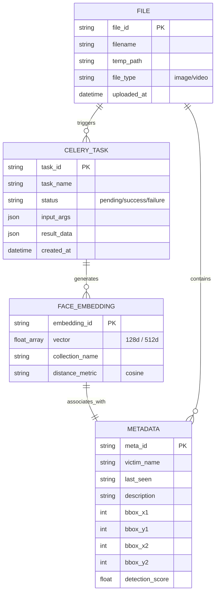

# Production Ready Report: Mafqood AI System

This report provides a comprehensive overview of the Mafqood AI system's architecture, components, and current status regarding production readiness.

## 1. System Architecture Overview

The system is built as a distributed AI backend using **FastAPI** for the API layer, **InsightFace** for computer vision, **ChromaDB** for vector storage, and **Celery** with **Redis** for asynchronous processing.

```mermaid
sequenceDiagram
    participant User as User / Client
    participant API as FastAPI (API Layer)
    participant Redis as Redis (Queue)
    participant Worker as Celery Worker
    participant InsightFace as InsightFace (Model)
    participant VDB as ChromaDB (Vector Store)

    rect rgb(30, 32, 32)
    Note over User, VDB: Asynchronous Image Processing Workflow
    User->>API: POST /api/cv/process (Upload Image)
    API->>API: Save to temp_uploads
    API-->>Redis: Dispatch process_image_task
    API-->>User: 202 Accepted (Task ID)
    
    Redis->>Worker: Consume Task
    Worker->>InsightFace: Extract Face Embeddings
    InsightFace-->>Worker: Embedding Vector (128d/512d)
    Worker->>VDB: Upsert Embedding + Metadata
    VDB-->>Worker: Success
    end

    rect rgb(40, 42, 42)
    Note over User, VDB: Face Search Workflow
    User->>API: POST /api/cv/search (Query Image)
    API-->>Redis: Dispatch search_faces_task
    API-->>User: 202 Accepted (Task ID)
    
    Redis->>Worker: Consume Task
    Worker->>InsightFace: Detect & Extract Query Embedding
    Worker->>VDB: Search (Cosine Similarity)
    VDB-->>Worker: Top-N Results (IDs, Distances)
    Worker-->>Redis: Store Task Result
    
    User->>API: GET /api/classify/status/{id}
    API-->>User: Return Search Results
    end
```

---

## 2. API Endpoints Catalog

### Computer Vision (CV) Endpoints
| Method | Endpoint | Description | Mode |
| :--- | :--- | :--- | :--- |
| `POST` | `/api/cv/process` | Detect faces and save embeddings. | **Async** (Celery) |
| `POST` | `/api/cv/search` | Search for similar faces using an image. | **Async** (Celery) |
| `POST` | `/api/cv/process_video` | Extract frames and search faces in video. | **Async** (Celery) |
| `GET` | `/api/cv/health` | Service health check. | Sync |
| `GET` | `/api/cv/database/info` | Get Vector DB statistics. | Sync |
| `DELETE` | `/api/cv/faces` | Delete specific face records. | Sync |

### NLP & Content Moderation
| Method | Endpoint | Description | Mode |
| :--- | :--- | :--- | :--- |
| `POST` | `/api/classify` | Classify text for bad words (Arabic/English). | Sync/Async |
| `GET` | `/api/classify/status/{id}` | Check status of NLP task. | Sync |

### Web Interface
| Method | Endpoint | Description |
| :--- | :--- | :--- |
| `GET` | `/` | Home page. |
| `GET` | `/search` | Image search interface. |
| `POST` | `/search/results` | Synchronous search results for web users. |

---

## 3. AI Pipelines

### Computer Vision Pipeline (`FaceCVPipeline`)
- **Model**: `buffalo_l` (InsightFace).
- **Functionality**: Detection and embedding extraction (128d or 512d depending on model).
- **Filtering**: Minimum face size (40x40 pixels) and confidence threshold checks.
- **Video Logic**: Configurable sampling rate (default 15 frames) to optimize performance.

### NLP Pipeline (`BadWordsClassifier`)
- **Normalization**: Arabic text normalization (diacritics removal, Alef/Teh Marbuta unification).
- **Logic**: Keyword-based matching against a predefined list of sensitive words.

### Web Scraping Pipeline (`FacebookScraper`)
- **Purpose**: Automated data acquisition from social media (Facebook).
- **Technology**: BeautifulSoup (Parsing), Requests (Session Management).
- **Functionality**:
    - Automatic extraction of missing persons' details (Name, Age, Details).
    - Image URL extraction and local downloading.
    - Session-based crawling to bypass basic restrictions.

---

## 4. Vector Database (ChromaDB)

- **Storage**: Persistent storage in `./chroma_db`.
- **Metric**: Cosine Similarity (`hnsw:space: cosine`).
- **Collection**: `face_embeddings`.
- **Metadata**: Stores bounding boxes, detection scores, and original image paths linked to each embedding.

---

## 5. Background Tasks (Celery)

The system offloads heavy computations to Celery workers to maintain API responsiveness.

| Task Name | Responsibility | Retry Policy |
| :--- | :--- | :--- |
| `process_image_task` | Detection -> Embedding -> VDB Upsert | 5 retries, exp. backoff |
| `process_video_task` | Frame sampling -> Search -> Results Aggregation | 1 retry |
| `search_faces_task` | Search VDB by image embedding | 5 retries, exp. backoff |
| `process_text_task` | Content moderation for text | - |

---

## 6. Production Readiness Assessment

### Current Strengths
- **Scalability**: Decoupled architecture using Celery/Redis allows scaling workers independently.
- **Persistence**: ChromaDB is used in persistent mode.
- **Error Handling**: Implemented retry logic with exponential backoff for critical CV tasks.

### Recommendations for Production Deployment
> [!IMPORTANT]
> **GPU Acceleration**: The current configuration defaults to CPU (`ctx_id: -1`). For production, nodes with NVIDIA GPUs should be used (set `CV_CTX_ID: 0`).

> [!WARNING]
> **Security**: Ensure the `temp_uploads` directory is regularly cleaned and API endpoints are protected by authentication (JWT/API Keys), as none are currently implemented in the core logic.

> [!TIP]
> **Monitoring**: Integrate Flower for Celery monitoring and Prometheus/Grafana for FastAPI metrics.

---

## 7. Data Acquisition Module (Web Scraping)

The project includes a specialized module for scraping data from social media platforms, currently focused on Facebook.

### Key Logic Flow
1. **Session Initialization**: `FacebookSession` handles auth and connection persistence.
2. **Page Fetching**: `FacebookScraper` retrieves the target HTML content.
3. **Parsing**: `parse_missing_persons` uses `BeautifulSoup` to scan for specific markup (`missing-person` class).
4. **Data Modeling**: Scraped data is structured into `MissingPerson` objects.
5. **Image Processing**: `downloader.py` asynchronously handles image retrieval and local storage for subsequent AI processing.

### Production Readiness for Scraper
- **Status**: Ready as a standalone utility.
- **Note**: Integration with the main Celery pipeline is recommended for large-scale data syncing.
