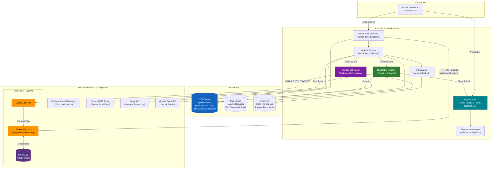
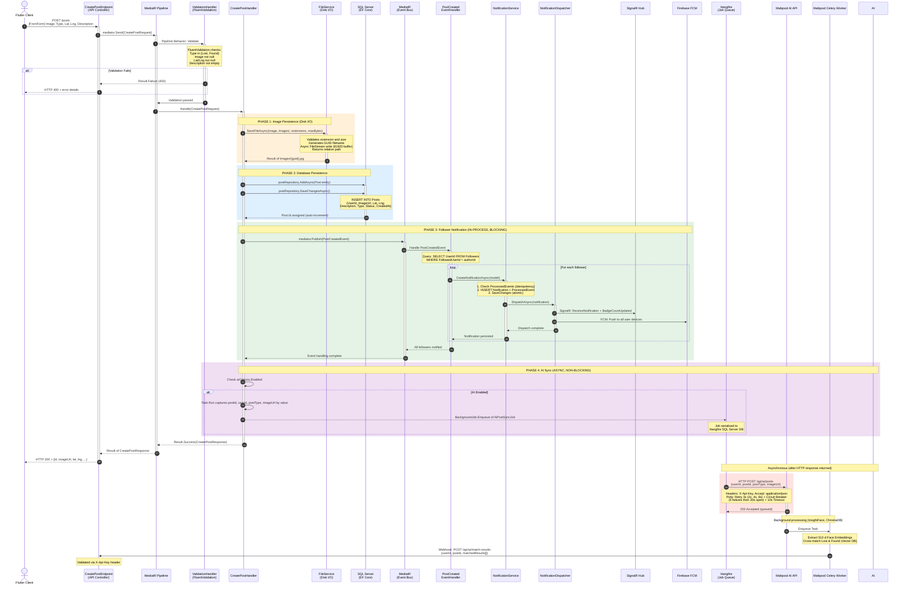
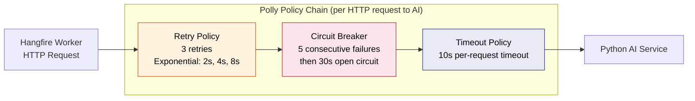
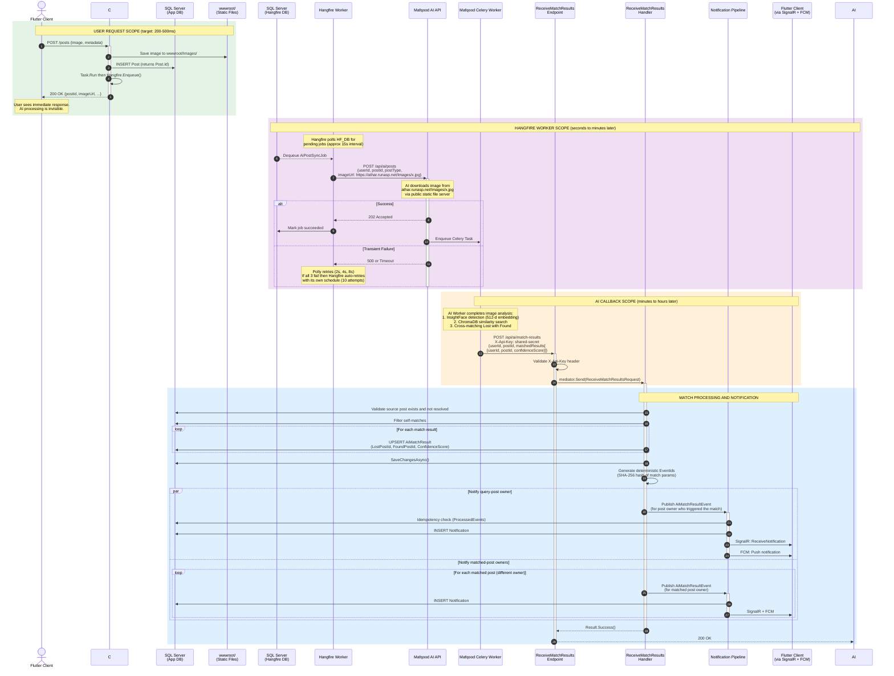
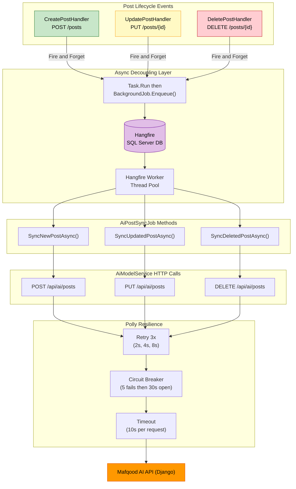
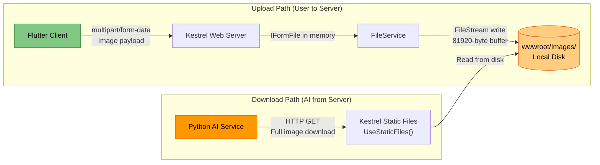
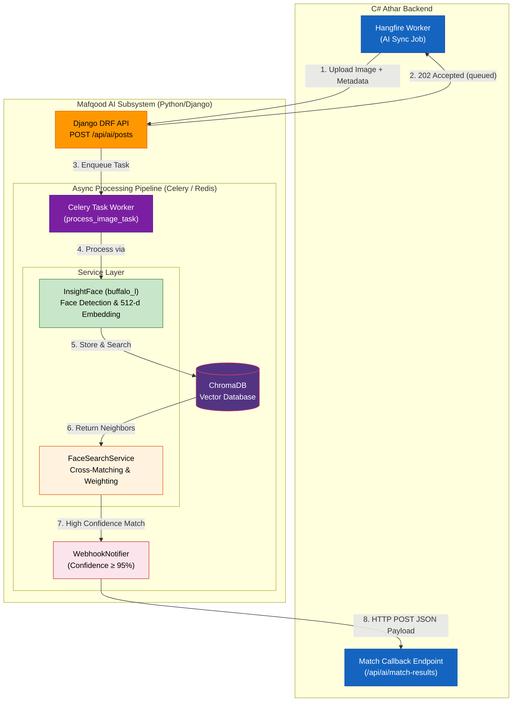
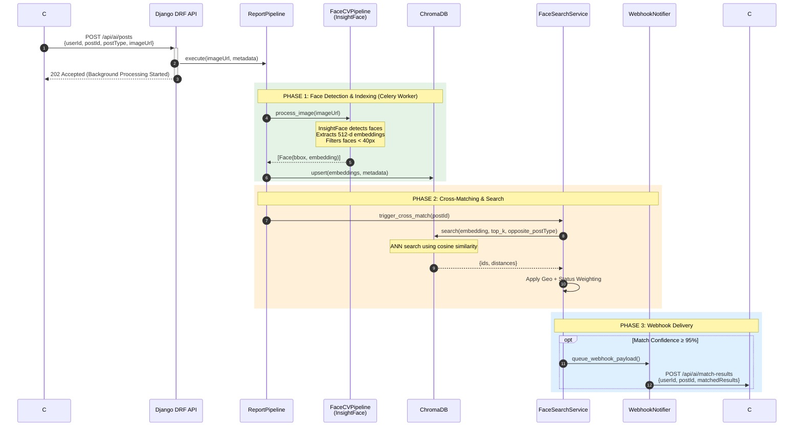

# Athar — Posts & AI Architecture Reference
### For: Senior Performance Engineer — Load Testing & Optimization
### Generated: 2026-07-26 | Source: Codebase Static Analysis

---

> **Audience**: This document is written for a performance engineer who needs to understand the system's
> internal architecture, critical data paths, I/O boundaries, and concurrency characteristics to design
> effective load tests and identify optimization opportunities.

---

## Table of Contents

1. [System Overview & High-Level Architecture](#1-system-overview--high-level-architecture)
2. [Deep Dive: The "Post" Subsystem & Data Flow](#2-deep-dive-the-post-subsystem--data-flow)
3. [AI Integration & Asynchronous Workflow](#3-ai-integration--asynchronous-workflow)
4. [Optimization & Load Testing Focus Areas](#4-optimization--load-testing-focus-areas)

---

## 1. System Overview & High-Level Architecture

### 1.1 Technology Stack

| Layer | Technology | Version | Notes |
|---|---|---|---|
| **Runtime** | ASP.NET Core | .NET 9.0 | Single-project vertical-slice architecture |
| **ORM** | Entity Framework Core | 9.0.13 | Code-first, SQL Server provider |
| **Database** | SQL Server | Remote hosted | Separate DBs for app data and Hangfire |
| **Auth** | ASP.NET Identity + JWT | — | `JwtBearerDefaults`, 30-min token expiry |
| **CQRS Mediator** | MediatR | 14.0.0 | Command/Query separation, pipeline behaviors |
| **Validation** | FluentValidation | 12.1.1 | Auto-validation via MediatR pipeline |
| **Object Mapping** | Mapster | 7.4.0 | Assembly-scanned configuration |
| **Background Jobs** | Hangfire | 1.8.23 | SQL Server storage, recurring + fire-and-forget |
| **Real-time** | SignalR | Built-in | 4 hubs, WebSocket transport, in-memory groups |
| **Push Notifications** | Firebase Admin SDK | 3.1.0 | FCM for Android/iOS push |
| **Email** | MailKit | 4.16.0 | Brevo SMTP relay |
| **HTTP Resilience** | Polly | 9.0.0 | Retry, Circuit Breaker, Timeout for AI calls |
| **Payments** | Stripe.net | 51.1.0 | FamilyCare subscriptions |
| **Caching** | `IDistributedCache` | In-memory | Used for location presence tracking |
| **API Docs** | Swashbuckle | 9.0.6 | Swagger UI with JWT auth |

### 1.2 Architectural Pattern

The project uses a **Vertical Slice Architecture** with **CQRS** (Command Query Responsibility Segregation):

- **No traditional layered architecture** (no separate Application/Domain/Infrastructure projects).
- Each feature is a **self-contained folder** under `Features/` containing: Endpoint (thin controller) → Request (MediatR `IRequest` + FluentValidation) → Handler (business logic) → Response DTO.
- **MediatR Pipeline Behavior**: `ValidationHandler<TRequest, TResponse>` intercepts all requests and runs FluentValidation before the handler executes.
- **Result Pattern**: All handlers return `Result<T>` (not exceptions) for business errors. `ResultExtensions.ToResponse()` maps to HTTP status codes.

### 1.3 High-Level Integration Diagram



### 1.4 Request Lifecycle Summary

Every API request traverses this pipeline:

```
HTTP Request
  → ASP.NET Controller (Endpoint)
    → mediator.Send(request)
      → ValidationHandler<T> (FluentValidation — rejects invalid requests)
        → Feature Handler (business logic, DB ops, events)
          → Result<T> returned
    → result.ToResponse() → HTTP Response
```

> [!IMPORTANT]
> The MediatR pipeline is synchronous within the request scope. All `INotification` (domain events) published via `mediator.Publish()` execute **in-process and block the HTTP response** unless explicitly wrapped in `Task.Run` or Hangfire.

---

## 2. Deep Dive: The "Post" Subsystem & Data Flow

### 2.1 Post Entity Data Structure

The `Post` entity (defined in `Entities/Posts/Post.cs`) represents a Lost or Found person/item report:

```csharp
public class Post
{
    public int Id { get; set; }                    // Auto-increment PK

    // ── Owner ────────────────────────────────────
    public string UserId { get; set; }             // FK → AspNetUsers.Id
    public ApplicationUser User { get; set; }

    // ── Content ──────────────────────────────────
    public string? ImageUrl { get; set; }           // Relative path: "Images/{guid}.jpg"
    public string? Description { get; set; }        // Free-text description

    // ── Geospatial ───────────────────────────────
    public double Latitude { get; set; }            // WGS84 decimal degrees
    public double Longitude { get; set; }           // WGS84 decimal degrees

    // ── Classification ───────────────────────────
    public PostType Type { get; set; }              // Lost = 0, Found = 1
    public PostStatus Status { get; set; }          // Active = 0, Resolved = 1

    // ── Engagement Counters ──────────────────────
    public int LikesCount { get; set; }             // Denormalized counter
    public int DislikesCount { get; set; }          // Denormalized counter

    // ── Timestamps ───────────────────────────────
    public DateTime CreatedAt { get; set; }
    public DateTime? UpdatedAt { get; set; }

    // ── Navigation Properties ────────────────────
    public List<PostComment> Comments { get; set; } // Threaded (self-join via ParentCommentId)
    public List<SavedPost> SavedByUsers { get; set; }
    public List<PostReact> Reacts { get; set; }     // Like/Dislike per user
}
```

**Related entities involved in a Post's lifecycle**:

| Entity | Relationship | Key Fields |
|---|---|---|
| `PostComment` | One-to-Many | `PostId`, `UserId`, `Text`, `ParentCommentId` (threaded replies) |
| `PostReact` | Many-to-Many (composite PK) | `UserId`, `PostId`, `ReactType` (Like/Dislike) |
| `SavedPost` | Many-to-Many (composite PK) | `UserId`, `PostId`, `SavedAt` |
| `AiMatchResult` | Many-to-Many (via AI) | `LostPostId`, `FoundPostId`, `ConfidenceScore`, `MatchedAt` |

### 2.2 Post CRUD Operations

| Operation | Endpoint | Handler | AI Sync | Notification |
|---|---|---|---|---|
| **Create** | `POST /posts` | `CreatePostHandler` | Hangfire enqueue | `PostCreatedEvent` → followers |
| **Update** | `PUT /posts/{id}` | `UpdatePostHandler` | Hangfire enqueue | None |
| **Delete** | `DELETE /posts/{id}` | `DeletePostHandler` | Hangfire enqueue | None |
| **Get by ID** | `GET /posts/{id}` | `GetPostByIdHandler` | None | None |
| **Get all** | `GET /posts` | `GetPostsHandler` | None | None |

### 2.3 Create Post — Full Data Flow Sequence Diagram



### 2.4 Feed Ranking Algorithm

When users query the feed, posts are scored using a **weighted multi-factor algorithm** (defined in `PostScoringService`):

```
Score = (LocationScore x 70) + (TimeScore x 20) + (FollowerScore x 10)
```

| Component | Weight | Formula | Decay Model |
|---|---|---|---|
| **Location** | 70 | `HalfLifeKm / (HalfLifeKm + distanceKm)` | Inverse-hyperbolic decay. Floor = 0.03 |
| **Time** | 20 | `e^(-ln(2) / halfLifeHours x ageHours)` | Exponential decay. Half-life = 48h |
| **Follower** | 10 | `1.0` if following, `0.0` otherwise | Binary |

> [!WARNING]
> **Performance-critical**: `MaxFeedBatchSize = 2000` posts are loaded into memory for in-memory scoring. The Haversine distance calculation (trigonometric) runs per-post per-request. With 2000 posts and 100 concurrent feed requests, this is 200,000 Haversine computations per second.

---

## 3. AI Integration & Asynchronous Workflow

### 3.1 Communication Protocol

The C# backend communicates with the Python AI microservice over **synchronous HTTP REST**, wrapped in **Polly resilience policies** and decoupled from the user request via **Hangfire background jobs**.

| Aspect | Detail |
|---|---|
| **Transport** | HTTP/HTTPS (REST) |
| **AI Base URL** | Configurable via `appsettings.json` → `AiModel:BaseUrl` |
| **Tunneling** | ngrok (development/staging) |
| **Authentication** | Shared API key via `X-Api-Key` header (symmetric, both directions) |
| **Serialization** | JSON (`camelCase` naming policy) |
| **Content-Type** | Explicit `StringContent` (not `JsonContent`) — required for Polly retry compatibility |

### 3.2 AI Service Interface

The C# → Python contract is defined in `IAiModelService`:

```csharp
public interface IAiModelService
{
    Task SendPostAsync(string userId, int postId, PostType postType, string imageUrl);
    Task UpdatePostAsync(string userId, int postId, PostType postType, string imageUrl);
    Task DeletePostAsync(int postId, string userId, PostType postType, string imageUrl);
    Task MarkPostResolvedAsync(string userId, int postId);
}
```

> [!IMPORTANT]
> **Critical implementation detail** (from `AiModelService.cs`): The `imageUrl` sent to the AI service is converted from a relative path (`Images/abc.jpg`) to an **absolute public URL** (`https://athar.runasp.net/Images/abc.jpg`). The AI service **downloads the image** from this URL — meaning the C# backend's static file server must handle the AI service's download requests concurrently with user traffic.

### 3.3 Polly Resilience Pipeline

Three policies are chained on the `HttpClient` pipeline (configured in `DependencyInjection.cs`):



**Worst-case latency per AI sync**: 3 retries x (2+4+8)s backoff + 10s timeout = **up to 24 seconds** before giving up. This is why the call MUST NOT be on the HTTP request path.

### 3.4 Asynchronous Processing Pattern — Complete Diagram



### 3.5 Idempotency Strategy (Critical for Load Testing)

The system implements **two-level idempotency** to handle duplicate AI callbacks and concurrent notifications:

| Level | Mechanism | Location |
|---|---|---|
| **Application** | `ProcessedEvents` table check before creating notification | `NotificationService.CreateNotificationAsync()` |
| **Database** | `UNIQUE` constraint on `Notification.EventId` | Catches race conditions when app-level check passes concurrently |
| **Deterministic EventId** | `SHA-256("ai-match:{userId}:{lostPostId}:{foundPostId}:{role}")` → first 16 bytes as Guid | `ReceiveMatchResultsHandler.GenerateDeterministicEventId()` |

> [!NOTE]
> The deterministic EventId generation means that if the AI service sends the same match results twice (network retry, duplicate webhook), the system produces identical EventIds and the idempotency guard prevents duplicate notifications. This must be validated under load.

### 3.6 AI Sync Lifecycle Across All Post Operations



---

## 4. Optimization & Load Testing Focus Areas

### 4.1 Write-Heavy Operations — Concurrency Hotspots

#### 4.1.1 Post Creation Concurrency

| Concern | Detail | Risk Level |
|---|---|---|
| **Disk I/O contention** | `FileService.SaveFileAsync()` writes to `wwwroot/Images/` using `FileStream` with 81920-byte buffer and `FileShare.None`. Under concurrent writes, OS-level file creation is serialized per-directory. | Medium |
| **DB write amplification** | A single `CreatePost` triggers: 1 INSERT (Post) + N INSERTs (Notifications for N followers) + N INSERTs (ProcessedEvents) + potentially N SignalR + N FCM calls — **all within the same HTTP request**. | High |
| **Follower fan-out** | Users with many followers create O(N) notifications synchronously. A user with 1000 followers = 1000 DB inserts + 1000 SignalR pushes + 1000 FCM calls before the HTTP response returns. | **Critical** |
| **Hangfire enqueue race** | `Task.Run(() => BackgroundJob.Enqueue(...))` is fire-and-forget. Under heavy load, Hangfire SQL inserts may contend with app DB traffic on the same SQL Server. | Medium |

> [!CAUTION]
> **Load Test Scenario**: Simulate 100 concurrent users creating posts, where 10% of those users have 500+ followers. Measure p99 response time and DB connection pool exhaustion.

#### 4.1.2 AI Match Callback Concurrency

| Concern | Detail | Risk Level |
|---|---|---|
| **UPSERT pattern** | `ReceiveMatchResultsHandler` does a `FindAsync` + conditional `AddAsync`/`UpdateAsync` per match — no DB-level upsert. Under concurrent callbacks for the same Lost-Found pair, this can cause duplicate key violations (caught by UNIQUE constraint). | Medium |
| **Notification fan-out** | Each match generates 2 notifications (query owner + matched owner), each with SignalR + FCM dispatch. A callback with 10 matches = 20 notifications in a single request. | Medium |
| **Deterministic EventId collision** | By design, duplicate callbacks produce identical EventIds — handled by ProcessedEvents table. Load test should verify this idempotency holds under concurrent duplicate callbacks. | Low (by design) |

> [!TIP]
> **Load Test Scenario**: Send 50 concurrent AI callback requests with overlapping match pairs to validate idempotency produces exactly 0 duplicate notifications.

### 4.2 I/O and Network Bottlenecks

#### 4.2.1 Image Pipeline Bottleneck



**Key bottleneck**: When a post is created, the image is uploaded to disk. Shortly after, the AI service downloads that same image from the server's static file middleware. Under load:

- **Disk I/O**: Concurrent uploads and AI downloads compete for the same disk.
- **Network bandwidth**: Large images (up to `MaxImageBytes`) are transferred twice — once uploaded by the user, once downloaded by the AI service.
- **Static file middleware**: `UseStaticFiles()` is not rate-limited. The AI service could saturate the download bandwidth.

> [!WARNING]
> **Load Test Scenario**: Upload 200 images in 60 seconds while the AI service simultaneously downloads 200 previously-uploaded images. Monitor disk queue length and network saturation.

#### 4.2.2 AI Service Latency & Timeout

| Parameter | Value | Impact |
|---|---|---|
| Per-request timeout | **10 seconds** | If the AI service is slow, Polly kills the request at 10s |
| Retry backoff | **2s → 4s → 8s** (14s total) | Worst case = 10s + 14s = 24s per sync attempt |
| Circuit breaker threshold | **5 consecutive failures** | After 5 failures, circuit opens for 30s — all AI syncs fail-fast |
| Hangfire auto-retry | **10 attempts** (default) | Failed jobs retry with increasing delays over hours |

> [!TIP]
> **Load Test Scenario**: Simulate AI service degradation (artificial 8s latency) and observe: Do Hangfire queues back up? Does the circuit breaker open correctly? What happens to post creation throughput?

#### 4.2.3 SignalR Connection Scaling

| Component | Implementation | Bottleneck |
|---|---|---|
| `ConnectionManager` | `ConcurrentDictionary<string, HashSet<string>>` (Singleton, in-memory) | Single-server only. Under 10K+ concurrent connections, `lock(connections)` per user becomes a contention point |
| SignalR groups | In-memory (no Redis backplane) | Cannot scale horizontally without adding `AddStackExchangeRedis()` |
| Notification delivery | Sequential `foreach` over all delivery channels | If FCM is slow, SignalR delivery waits (channels execute sequentially within the dispatcher) |

> [!TIP]
> **Load Test Scenario**: Establish 5000 concurrent WebSocket connections across all 4 hubs and measure message delivery latency under sustained notification load.

### 4.3 Potential Optimization Ideas (For Discussion)

*Note: The ideas listed below are initial thoughts based on the current architecture. I am looking forward to your architectural review and guidance on the best approach for these bottlenecks during our load testing phase.*

#### 4.3.1 Critical — Follower Notification Fan-out

**Problem**: Creating a post triggers synchronous in-process notification for every follower, blocking the HTTP response.

**Potential Approach**:
```diff
- Current Flow:
-   HTTP Handler → mediator.Publish(PostCreatedEvent)
-     → loop N followers → N DB writes → N SignalR → N FCM
-     → HTTP 200 (delayed by all N iterations)

+ Proposed Flow:
+   HTTP Handler → Hangfire.Enqueue(NotifyFollowersJob)
+     → HTTP 200 (immediate, sub-100ms)
+   Hangfire Worker → batch followers
+     → batch INSERT notifications → batch SignalR → batch FCM

```

#### 4.3.2 High — Feed Scoring In-Memory Computation

**Problem**: `MaxFeedBatchSize = 2000` posts loaded into memory, each requiring a Haversine calculation.

**Idea to Explore**:

* Implement spatial indexing (SQL Server `geography` type or in-memory R-tree) for pre-filtering by bounding box.
* Cache scored feeds per user-location grid cell with short TTL (30-60 seconds).
* Consider pre-computed materialized views for "top posts near location" with periodic refresh.

#### 4.3.3 High — Connection Pool Tuning

**Problem**: Two separate SQL Server databases (app + Hangfire) share the default connection pool settings.

**Idea to Explore**:

* Explicitly configure `Max Pool Size` in connection strings (default is 100).
* Under load with concurrent post creation + AI callbacks + Hangfire polling, the pool can exhaust.
* Monitor with `sys.dm_exec_connections` and EF Core diagnostic events.

#### 4.3.4 Medium — Notification Dispatcher Parallelism

**Problem**: `NotificationDispatcher` iterates delivery channels sequentially (`foreach`). If FCM takes 2s, SignalR delivery for the same notification is delayed.

**Idea to Explore**:

```diff
- // Current: Sequential
- foreach (var channel in channels)
-     await channel.DeliverAsync(notification, ct);

+ // Proposed: Parallel
+ await Task.WhenAll(channels.Select(ch => ch.DeliverAsync(notification, ct)));

```

#### 4.3.5 Medium — CQRS Read-Side Caching

**Problem**: Post queries (feed, search, get-by-id) hit the database on every request with no caching layer.

**Idea to Explore**:

* Cache `GetPostById` responses with `IDistributedCache` (2-5 minute TTL).
* Cache feed results per user-location cell (invalidate on new post in same cell).
* Implement ETag/If-None-Match for client-side caching of unchanged feeds.

#### 4.3.6 Low — Static File CDN Offload

**Problem**: Image serving and AI download both hit the same Kestrel process and local disk.

**Idea to Explore**:

* Offload `wwwroot/Images/` to Azure Blob Storage or AWS S3 with CDN.
* Update `AiModelService.ToAbsoluteImageUrl()` to return CDN URLs.
* Eliminates disk I/O contention between user uploads and AI image downloads.

---

## 5. Mafqood AI Subsystem Architecture (Python)

### 5.1 AI Technology Stack

| Layer | Technology | Purpose |
|---|---|---|
| **Web Framework** | Django 6 + DRF | API endpoints, serialization, dual JSON/HTML rendering |
| **Face Recognition**| InsightFace (`buffalo_l`) + ONNX | Face detection, alignment, and 512-d embeddings |
| **Computer Vision** | OpenCV 4.8 + ONNX Runtime | Image/video decoding, frame sampling, neural re-aging |
| **DNA Matching** | Forensic Loci Algorithm | Direct, Parent-Child, and Sibling STR matching |
| **Vector DB** | ChromaDB 0.4 | Fast Approximate Nearest-Neighbor (ANN) lookups |
| **Task Queue** | Celery 5.2 + Redis 7 | Background async tasks (clustering, DNA matching, polling) |
| **Containerization**| Docker + Docker Compose | Full stack orchestration |

### 5.2 Internal AI Architecture Pattern

The AI microservice follows a **Domain-Driven, Layered Architecture**:
- **Presentation Layer**: Exposes the REST API via Django REST Framework (DRF).
- **Pipeline Layer**: Orchestrates complex flows (e.g., `SearchPipeline` for routing image vs. video, `ReportPipeline` for indexing).
- **Service Layer**: Houses the core domain logic (`FaceCVPipeline`, `FaceSearchService`, `AgeProgressionGAN`, `DNASearchService`).
- **Infrastructure Layer**: Manages persistent stores (ChromaDB) and async tasks (Celery/Redis workers).

### 5.3 Face Search & Match Pipeline

#### Request Lifetime & Subsystem Schema

This flowchart illustrates the end-to-end journey of a request originating from the C# backend, flowing through the Python AI services, and returning a high-confidence match notification.



#### Detailed Execution Sequence

When the C# backend sends a `POST /api/ai/posts` request, the exact synchronous and asynchronous interactions are as follows:



### 5.4 Specialized AI Subsystems

#### 5.4.1 CPU-Optimized Age Progression
For missing persons cases spanning years, the system utilizes a **CPU-optimized FRAN U-Net** neural model compiled to ONNX. It dynamically processes 5-channel residual age mappings to generate aged variants (+5, +10, +15 years) of a face, which are then seamlessly run through the search pipeline without GPU dependency.

#### 5.4.2 Forensic DNA Matching (Asynchronous)
For DNA reports, the system exposes `/api/ai/dna/posts`. 
- **Algorithm**: Compares Short Tandem Repeat (STR) loci (e.g., D3S1358, vWA, FGA).
- **Matching Types**: Direct (identical), Parent-Child (1 allele overlap per locus), and Sibling.
- **Workflow**: A background Celery task cross-references new profiles against the database. High-confidence matches trigger a dedicated DNA webhook payload back to the C# application.

#### 5.4.3 Video Intelligence
If a video is submitted for search, the `VideoProcessor` component samples frames at configurable intervals, runs them through the `FaceCVPipeline`, and deduplicates faces across frames before querying ChromaDB.

### 5.5 Performance Profiling & Time Complexity

To assist with load testing and capacity planning, the following breakdowns outline the expected time complexity of the underlying AI algorithms and a theoretical execution timeline for a standard AI processing job.

#### 5.5.1 AI Pipeline Algorithm Complexity

| Subsystem Component | Algorithm / Technology | Time Complexity | Bottleneck Profile |
|---|---|---|---|
| **Face Detection** | RetinaFace (CNN) | `O(W × H)` (W, H = Image dimensions) | Compute bound (CPU/GPU) |
| **Feature Extraction** | ArcFace (ResNet) | `O(1)` (Fixed 112x112 pixel crop) | Compute bound (CPU/GPU) |
| **Vector Search (ANN)**| HNSW Graph (ChromaDB) | `O(log N)` (N = stored embeddings) | Memory / RAM Bandwidth |
| **DNA STR Matching** | Array Intersection | `O(N × L)` (N = profiles, L = loci) | Memory / L3 Cache |
| **Age Progression** | FRAN U-Net (ONNX) | `O(P)` (P = model parameters) | Compute bound (High latency) |

#### 5.5.2 Execution Timeline (Single Image Post)

The following Gantt chart illustrates the expected end-to-end latency for a standard image post, assuming no queue wait time and processing on a standard CPU-only worker node. 

```mermaid
gantt
    title Single Post AI Pipeline Latency (Approx CPU Times)
    dateFormat  s
    axisFormat  %S.%L
    
    section C# Backend
    Hangfire HTTP POST     :a1, 0, 0.5s
    Receive Match Webhook  :a2, after c5, 0.5s
    
    section AI Django API
    Validate & Enqueue     :b1, after a1, 0.2s
    
    section AI Celery Worker
    Download Image I/O     :c1, after b1, 0.8s
    Face Detection (ONNX)  :c2, after c1, 1.2s
    Feature Embedding      :c3, after c2, 0.5s
    ChromaDB ANN Search    :c4, after c3, 0.1s
    Weighting & Scoring    :c5, after c4, 0.1s
```



> [!WARNING]
> **Latency Multipliers**: If a post contains a **Video**, the `VideoProcessor` extracts frames at 1 FPS. A 10-second video will run the `Face Detection` and `Feature Embedding` steps **10 times**, scaling the worker phase from ~2.7s to over 15s. Ensure Celery workers are scaled horizontally to prevent queue starvation during video batch processing.
